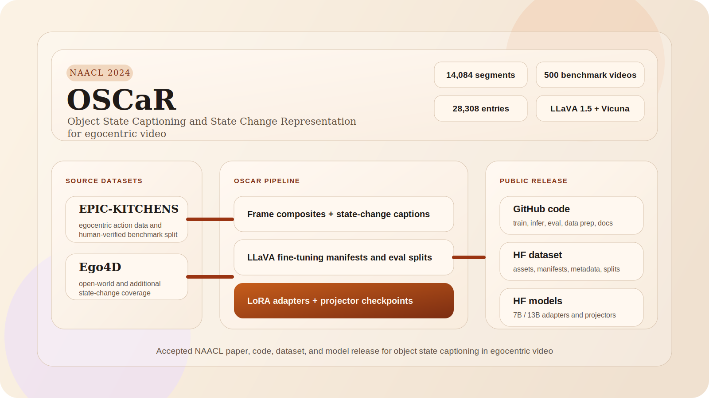

# OSCaR: Object State Captioning and State Change Representation

<p align="center">
  <a href="https://aclanthology.org/2024.findings-naacl.226.pdf">Paper PDF</a> •
  <a href="https://arxiv.org/abs/2402.17128">arXiv</a> •
  <a href="https://nguyennm1024.github.io/projects/oscar.html">Project Page</a> •
  <a href="https://github.com/nguyennm1024/OSCaR">GitHub</a> •
  <a href="https://huggingface.co/datasets/ali-vosoughi/oscar-dataset">Dataset</a> •
  <a href="https://huggingface.co/ali-vosoughi">Models</a>
</p>

<p align="center">
  
</p>

OSCaR is the public code release for the NAACL 2024 paper
[OSCaR: Object State Captioning and State Change Representation](https://aclanthology.org/2024.findings-naacl.226.pdf).

This repository publishes the LLaVA-derived training, inference, evaluation,
and data-preparation code used for OSCaR, alongside release-grade
documentation for the corresponding Hugging Face dataset and model repos.

## Start Here

This public release includes everything needed to use OSCaR:

- Code: this GitHub repo contains training, inference, evaluation, and data-preparation code.
- Dataset: [ali-vosoughi/oscar-dataset](https://huggingface.co/datasets/ali-vosoughi/oscar-dataset) contains the released OSCaR assets, manifests, metadata, and splits.
- Weights: [ali-vosoughi on Hugging Face](https://huggingface.co/ali-vosoughi) contains the released OSCaR model artifacts.

Released weights are:

- LoRA adapters: 7B OSCaR, 13B OSCaR, and 13B mixed.
- Projector checkpoints: 7B and 13B.

Merged full-model checkpoints are not part of the current OSCaR release.

## Common Workflows

If you want to run the released 13B model:

```bash
huggingface-cli download ali-vosoughi/oscar-llava-v1.5-13b-oscar-adapter --local-dir ../oscar-llava-v1.5-13b-oscar-adapter
python -m llava.serve.cli \
  --model-path ../oscar-llava-v1.5-13b-oscar-adapter \
  --model-base lmsys/vicuna-13b-v1.5 \
  --image-file /path/to/image.jpg
```

If you want to use the released dataset:

```bash
huggingface-cli download ali-vosoughi/oscar-dataset --repo-type dataset --local-dir ../oscar-dataset
export DATASET_ROOT=../oscar-dataset
export PATH_PREFIX="$DATASET_ROOT/data"
```

If you want to reproduce OSCaR fine-tuning:

```bash
huggingface-cli download ali-vosoughi/oscar-llava-v1.5-13b-projector --local-dir ../oscar-llava-v1.5-13b-projector
DATASET_ROOT=../oscar-dataset \
MM_PROJECTOR_PATH=../oscar-llava-v1.5-13b-projector/mm_projector.bin \
bash scripts/train/finetune_v1_5_13b_oscar_lora.sh
```

## Project Overview

OSCaR studies object state captioning and state change representation for
egocentric video. The public release packages the training and inference code,
the Hugging Face dataset and model repos, and the GitHub Pages project site for
the NAACL 2024 paper release.
The released OSCaR frames and clip-level assets are derived from the
EPIC-KITCHENS and Ego4D source datasets.

Paper-level release facts:

- annotated segments reported in the paper: `14,084`
- human-verified benchmark videos: `500`
- LLaVA fine-tuning entries in the preserved OSCaR manifest: `28,308`
- backbone family: `LLaVA v1.5` with `Vicuna 7B/13B` and `CLIP ViT-L/336`

## Project Links

- Project page: [nguyennm1024.github.io/projects/oscar](https://nguyennm1024.github.io/projects/oscar.html)
- Paper PDF: [2024.findings-naacl.226.pdf](https://aclanthology.org/2024.findings-naacl.226.pdf)
- arXiv: [arXiv:2402.17128](https://arxiv.org/abs/2402.17128)
- Code: [github.com/nguyennm1024/OSCaR](https://github.com/nguyennm1024/OSCaR)
- Dataset: [ali-vosoughi/oscar-dataset](https://huggingface.co/datasets/ali-vosoughi/oscar-dataset)

Model repos:

- [7B OSCaR adapter](https://huggingface.co/ali-vosoughi/oscar-llava-v1.5-7b-oscar-adapter)
- [13B OSCaR adapter](https://huggingface.co/ali-vosoughi/oscar-llava-v1.5-13b-oscar-adapter)
- [13B mixed adapter](https://huggingface.co/ali-vosoughi/oscar-llava-v1.5-13b-mixed-adapter)
- [7B projector](https://huggingface.co/ali-vosoughi/oscar-llava-v1.5-7b-projector)
- [13B projector](https://huggingface.co/ali-vosoughi/oscar-llava-v1.5-13b-projector)

## Source Datasets

- [EPIC-KITCHENS](https://epic-kitchens.github.io/)
- [Ego4D](https://ego4d-data.org/)

OSCaR is built from clips and frames sourced from these egocentric video
datasets. The public OSCaR dataset release should be understood as a derived
release built on top of EPIC-KITCHENS and Ego4D assets.

## Use The Dataset

1. Download the HF dataset repo locally.
2. Point OSCaR to it with `DATASET_ROOT`.
3. Use `manifests/llava_data.json` for training and `splits/data_mapping_final_EK_test.csv` for the held-out benchmark split.

```bash
huggingface-cli download ali-vosoughi/oscar-dataset --repo-type dataset --local-dir ../oscar-dataset
export DATASET_ROOT=../oscar-dataset
bash scripts/train/finetune_v1_5_13b_oscar_lora.sh
```

For evaluation and inspection, the most useful entry files are
`metadata/segment_index.csv`, `manifests/llava_data.json`, and
`splits/data_mapping_final_EK_test.csv`.

## Authors

- [Nguyen Nguyen](https://nguyennm1024.github.io/)
- [Jing Bi](https://jing.vision/)
- [Ali Vosoughi](https://alivosoughi.com/)
- [Yapeng Tian](http://www.yapengtian.com/)
- [Pooyan Fazli](http://pooyanfazli.com/)
- [Chenliang Xu](http://www.cs.rochester.edu/~cxu22/)

## What This Repo Contains

- projector pretraining code for the LLaVA v1.5 stack
- OSCaR-only LoRA fine-tuning scripts for Vicuna 7B and 13B
- mixed-data 13B LoRA fine-tuning that combines OSCaR with LLaVA v1.5 mix data
- benchmark and open-world inference entrypoints
- text-generation evaluation scripts
- dataset-preparation utilities used around manifests, splits, and output conversion

## Reported Training Configuration

The public scripts reflect the paper and local training artifacts:

- base models: `lmsys/vicuna-7b-v1.5` and `lmsys/vicuna-13b-v1.5`
- vision tower: `openai/clip-vit-large-patch14-336`
- LoRA rank: `128`
- LoRA alpha: `256`
- epochs: `1`
- learning rate: `2e-4`
- batch size per device: `16` for OSCaR-only runs
- max sequence length: `2048`

The 13B mixed-data run also has a public script matching the logged local run:

- per-device batch size: `8`
- gradient accumulation: `2`
- save steps: `300`

## Quickstart

Environment setup is UV-based:

```bash
uv venv --python 3.10 .venv
source .venv/bin/activate
uv pip install -e .[train,inference,eval,release]
```

Detailed setup: [INSTALL.md](INSTALL.md)  
Training guide: [TRAIN.md](TRAIN.md)  
Inference guide: [INFERENCE.md](INFERENCE.md)  
Evaluation guide: [EVAL.md](EVAL.md)  
Release guide: [RELEASE.md](RELEASE.md)

## Repository Layout

- `llava/`: model, training, evaluation, and serving code
- `scripts/train/`: projector pretraining, LoRA fine-tuning, merge, and cluster launcher examples
- `scripts/infer/`: public inference wrappers for benchmark and open-world evaluation
- `scripts/eval/`: benchmark metric scripts
- `scripts/data/`: manifest, split, QA-generation, and output-conversion utilities
- `scripts/release/`: Hugging Face card generation and upload helpers
- `configs/deepspeed/`: public DeepSpeed configs
- `docs/`: release docs and GitHub Pages content

## Notes On Dataset And Weights

This repository is intentionally code-first. Large assets are kept out of GitHub:

- OSCaR dataset assets and manifests live in the Hugging Face dataset repo
- projector checkpoints, adapters, and merged-model release artifacts live in the Hugging Face model repos

The code here expects those assets to be mounted or downloaded locally and then
referenced through CLI arguments or environment variables.

## Public Release Structure

OSCaR is intentionally split across public surfaces:

- this GitHub repository for code, install instructions, and reproducibility docs
- the Hugging Face dataset repo for released OSCaR assets and metadata
- the Hugging Face model repos for projector checkpoints and adapter weights
- the project page for paper-oriented presentation and public links

If you are landing here first, the project page is the shortest path to the
paper, code, dataset, and weights:

- [nguyennm1024.github.io/projects/oscar](https://nguyennm1024.github.io/projects/oscar.html)

## Citation

If OSCaR is useful in your work, please cite:

```bibtex
@inproceedings{nguyen2024oscar,
  title={OSCaR: Object State Captioning and State Change Representation},
  author={Nguyen, Nguyen and Bi, Jing and Vosoughi, Ali and Tian, Yapeng and Fazli, Pooyan and Xu, Chenliang},
  booktitle={North American Chapter of the Association for Computational Linguistics (NAACL)},
  year={2024}
}
```

## Acknowledgments

OSCaR builds on the LLaVA codebase and training stack. We thank the LLaVA
team for their strong open-source release and the foundation it provided for
this work.

OSCaR also builds on source video data from the
[EPIC-KITCHENS](https://epic-kitchens.github.io/) and
[Ego4D](https://ego4d-data.org/) projects. We thank those teams for creating
and releasing the datasets from which the OSCaR frames and clips are derived.

Approved for public release; distribution is unlimited.

This work has been supported by the Defense Advanced Research Projects Agency
(DARPA) under Contract `HR00112220003`. The content of the information does not
necessarily reflect the position of the Government, and no official endorsement
should be inferred.
